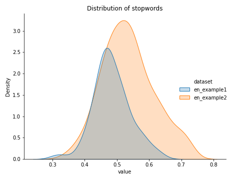
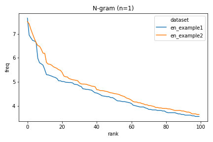
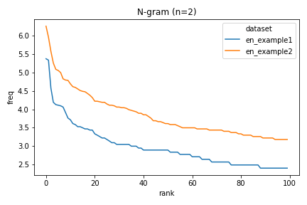
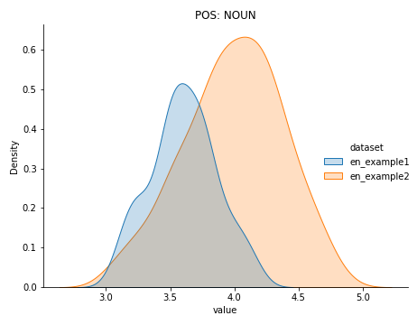
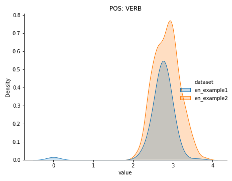
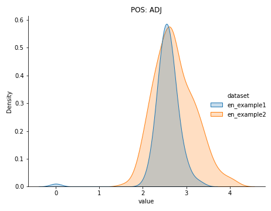
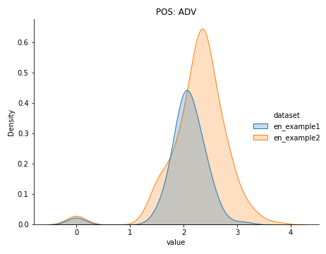

# A simple tool for text dataset analysis
## Overview
This project is designed to:
1. Simply analyse a single text dataset.
2. Analyse the differences between two or more text datasets.

The scripts are only tested on English and Chinese, though it can be easily extended to other languages with most features retained.

## Environment & install
- conda create -n myenv python=3.6.8
- source activate myenv
- pip install -r requirements.txt
- Corresponding spacy [8] and benepar [9] models need to be downloaded. Spacy:zh_core_web_trf, en_core_web_trf. Benepar: benepar_zh2, benepar_en3

## Analyse a single dataset
To check a single dataset, simply go to app directory and run check_dataset.py

**Pre-requisites**: The dataset needs to be **pre-tokenized** (see example in 'data' directory), with tokens seperated by white space. When generating datasets, you can make line breaks at the granularity you want. (e.g. by sentence)

Details of arguments:
```
path: Path to the target dataset
aspects: Aspects of the dataset you would like to investigate, valid options: ('distinct', 'basic', 'pos', 'dep', 'ner', 'stopword', 'zipflaw', 'concreteness'), you could also specify 'all' to include all above options.
n_grams: You could determine the n-grams for aspects of 'distinct' and zipflaw'.
lang: The language of the dataset
sample_N: If the dataset is too large, you could randomly choose N samples from it.
dataset: You could override the dataset name, otherwise it is set to the basename of the path.
cache_spacy_result: Whether the spacy parsing result is saved to disk (../spacy_temp)
```

**Aspects description**:\
\- distinct: Distinct value [1] measures the proportion of unique n-grams to the total number of n-grams. \
\- basic: Basic data analysis, including the number of unique tokena and average sentence length. \
\- pos: Distribution of part-of-speech. \
\- dep: Distribution of dependency relations. \
\- ner: Distribution of  Named Entities (The results of pos, dep and ner are extracted by Spacy [5]). \
\- stopword: Stopwords (We combine the stopwords list of Baidu [2] and NLTK [3] for english and use Baidu for Chinese. The stopword list is customisable.) \
\- zipflaw: Produce the statistics for the zipf's law [4] curves of n-grams. \
\- concreteness: concreteness value for n-grams(Source for English: [5], Source for Chinese: [6]). Notably, the concreteness of Chinese bi-gram is subtracted from 6 to ensure a consistency value range with English.

- (Example-1): check the basic statistics and n-gram(n=1,2,3) distinct values of a Chinese dataset.
```shell script
python check_dataset.py --path ../data/cn_example --aspects basic distinct --lang cn --n_grams 1 2 3
```
- (Example1 output):
```
[Dataset basic] Number of unique tokens: 2091, average sentence length: 103.785
+----+---------+------------+
|    |   ngram |   distinct |
|----+---------+------------|
|  0 |       1 |   0.735863 |
|  1 |       2 |   0.940652 |
|  2 |       3 |   0.965196 |
+----+---------+------------+
```
## Compare multiple datasets
To compare multiple datasets, you have to analyse each dataset before hand.
- (Example-1): Analyse all aspects of two datasets, all data used for plotting is stored in the results directory.
```shell script
python check_dataset.py --path ../data/en_example1 --aspects all --lang en --n_grams 1 2
python check_dataset.py --path ../data/en_example2 --aspects all --lang en --n_grams 1 2
```
Now you can open **vis.ipynb** in Jupterlab and visualize the distribution of stopwords/concretness and Zipf law curve.
You only have to modify 'data_path1' and 'data_path2' in each cell. Below we show some examples:
- Distribution of stopwords:

- Plots of zipf's law:


- Plots of Concretness values for different POS:





## Future work (Pull request is welcome)
- Support more languages
- Support more linguistic features and comparision demands.

## Reference
- \[1\]: Li, J., Galley, M., Brockett, C., Gao, J. and Dolan, B., 2015. A diversity-promoting objective function for neural conversation models. arXiv preprint arXiv:1510.03055.
- \[2\]: https://github.com/goto456/stopwords
- \[3\]: https://gist.github.com/sebleier/554280
- \[4\]: https://www.ncbi.nlm.nih.gov/pmc/articles/PMC4176592/
- \[5\]: Brysbaert, M., Warriner, A.B. and Kuperman, V., 2014. Concreteness ratings for 40 thousand generally known English word lemmas. Behavior research methods, 46(3), pp.904-911.
Vancouver
- \[6\]: https://www.ncbi.nlm.nih.gov/pmc/articles/PMC7307783/
- \[7\]: https://spacy.io/models
- \[8\]: 

